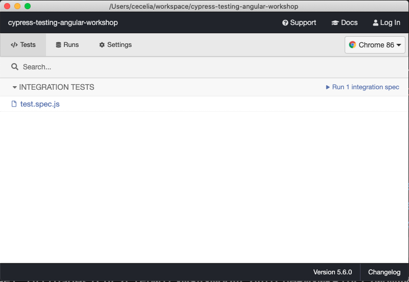

# Testing Angular Applications with Cypress Workshop

### Welcome to ngConf Enterprise!

## WORKSHOP SETUP

Please complete the following steps to prepare for the workshop. It may take a few minutes to install all the dependencies on your system.

### System Requirements

Please check the [Cypress system requirements](https://docs.cypress.io/guides/getting-started/installing-cypress.html#System-requirements) here to ensure you have all the dependencies needed.

Additionally, you'll need the following:

- An IDE or Code Editor (VS Code recommended)
- NPM or Yarn (Yarn recommended)
- Angular CLI (recommended, not required)

### Installation

1. Clone the repository locally. Make sure you are on the `starter` branch.
2. Run `yarn install` or `npm install` in the project directory.
3. If you have the Angular CLI installed, run `ng serve`. Otherwise, run `yarn run start` to start the dev server. Confirm the application runs locally.
4. In a new terminal, run `yarn run cypress open` or `npx cypress open`
5. Confirm the Cypress Test Runner opens on your machine. You should see a Graphical User Interface (GUI) like the screenshot below:

6. If the application runs and the Test Runner appears, you are ready for the workshop! You can stop both servers.

## APPLICATION

The Application Under Test is a fork of [gothinkster/angular-realworld-example-app](https://github.com/gothinkster/angular-realworld-example-app).

### About

Below is the application description from its README. Check out the repository directly for more details about the application.

> Angular codebase containing real world examples (CRUD, auth, advanced patterns, etc) that adheres to the [RealWorld](https://github.com/gothinkster/realworld-example-apps) spec and API.

### Demo

[Demo](https://angular.realworld.io)

> This codebase was created to demonstrate a fully fledged application built with Angular that interacts with an actual backend server including CRUD operations, authentication, routing, pagination, and more. We've gone to great lengths to adhere to the [Angular Styleguide](https://angular.io/styleguide) & best practices.

### API

> For convenience, we have a live API server running at https://conduit.productionready.io/api for the application to make requests against. You can view [the API spec here](https://github.com/GoThinkster/productionready/blob/master/api) which contains all routes & responses for the server.

### Functionality overview

The example application is a social blogging site (i.e. a Medium.com clone) called "Conduit". It uses a custom API for all requests, including authentication. You can view a live demo over at https://angular.realworld.io

#### General functionality:

- Authenticate users via JWT (login/signup pages + logout button on settings page)
- CRU\* users (sign up & settings page - no deleting required)
- CRUD Articles
- CR\*D Comments on articles (no updating required)
- GET and display paginated lists of articles
- Favorite articles
- Follow other users

#### The general page breakdown looks like this:

- Home page (URL: /#/ )
  - List of tags
  - List of articles pulled from either Feed, Global, or by Tag
  - Pagination for list of articles
- Sign in/Sign up pages (URL: /#/login, /#/register )
  - Uses JWT (store the token in localStorage)
  - Authentication can be easily switched to session/cookie based
- Settings page (URL: /#/settings )
- Editor page to create/edit articles (URL: /#/editor, /#/editor/article-slug-here )
- Article page (URL: /#/article/article-slug-here )
  - Delete article button (only shown to article's author)
  - Render markdown from server client side
  - Comments section at bottom of page
  - Delete comment button (only shown to comment's author)
- Profile page (URL: /#/profile/:username, /#/profile/:username/favorites )
  - Show basic user info
  - List of articles populated from author's created articles or author's favorited articles

## WORKSHOP OUTLINE

[Workshop Slides](https://cypress.slides.com/cecelia/testing-angular-applications-with-cypress)

This workshop contains seven interactive activities.

You can see potential solutions for these activities by navigating to the various branches:

- [Activity One Solution](https://github.com/CypressCecelia/cypress-testing-angular-workshop/tree/activity-one)
- [Activity Two Solution](https://github.com/CypressCecelia/cypress-testing-angular-workshop/tree/activity-two)
- [Activity Three Solution](https://github.com/CypressCecelia/cypress-testing-angular-workshop/tree/activity-three)
- [Activity Four Solution](https://github.com/CypressCecelia/cypress-testing-angular-workshop/tree/activity-four)
- [Activity Five Solution](https://github.com/CypressCecelia/cypress-testing-angular-workshop/tree/activity-five)
- [Activity Six Solution](https://github.com/CypressCecelia/cypress-testing-angular-workshop/tree/activity-six)
- [Activity Seven Solution](https://github.com/CypressCecelia/cypress-testing-angular-workshop/tree/activity-seven)
